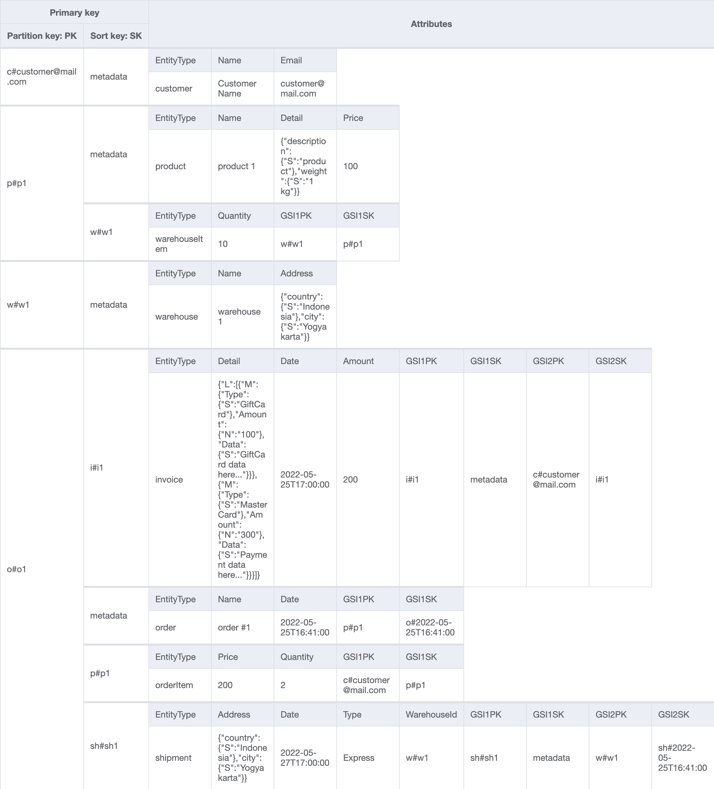
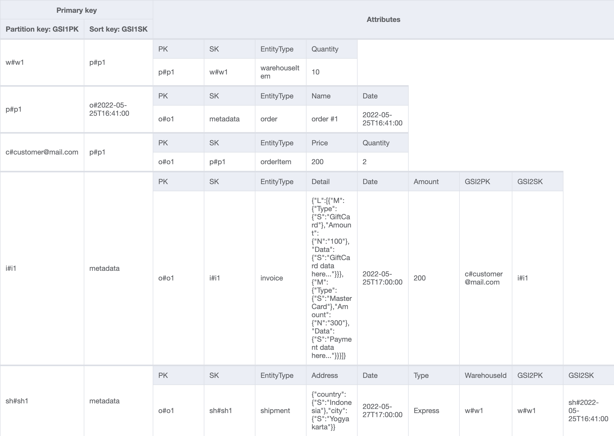
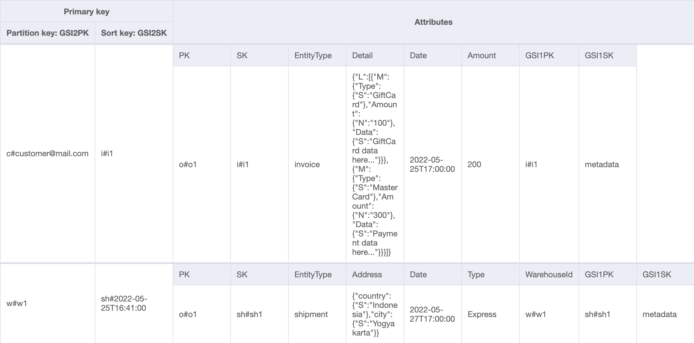

# Online Shop

In this use case, some thoughts and patterns are explained that can be helpful for several NoSQL data modeling scenarios. [NoSQL Workbench for Amazon DynamoDB](https://docs.aws.amazon.com/amazondynamodb/latest/developerguide/workbench.settingup.html) is used since it is a great tool for designing and visualizing data models for Amazon DynamoDB applications.

## Use Case

...
 
 A **customer** visits an online shop, browses through different **products** and places an **order** for some of the **products**. Based on the **invoice**, customer can pay using discount code or gift card and pay for the remaining amount by credit card. Purchased products will be picked from one or several **warehouses** and will be **shipped** to the provided address.
 
 ...

## Entity Relation Diagram

The existence of Customer, Product and Warehouse entities is independent of any other entity while Invoice and Shipment entities depend on Order entity. When going through each access pattern, the type of entity has an effect on how an item collection is built. Item collection refers to item(s) that have the same partition key.

In order to model the 1:M and M:N relations between entities in this scenario, composite primary key (partition key + sort key) is chosen for this table over simple primary key (partition key). Note that not all the items in the table models a relationship, there are items that represents the entity itself. These items will have the same value for both partition and sort keys.

## Access Patterns

Always start from the data access patterns of the application when designing the data model.

| Access Patterns |Table/GSI/LSI|Key Condition|Filter Expression| Example|
| :---        | :---         | :---     | :---    |:---|
| 1. Get customer for a given customerId|Table|PK=customerId and SK="metadata"|-|PK="c#customer@mail.com" and SK="metadata"|
| 2. Get product for a given productId   |Table|PK=productId and SK="metadata"|-|PK="p#p1" and SK="metadata"|
| 3. Get warehouse for a given warehouseId |Table|PK=warehouseId and SK="metadata"|-|PK="w#w1" and SK="metadata"
| 4. Get a product inventory for all warehouses by a productId |Table|PK=productId and SK=begins_with "w#"|-|PK="p#p1" and SK=begins_with "w#"
| 5. Get order for a given orderId |Table|PK=orderId and SK="metadata"|-|PK="o#o1" and SK="metadata"
| 6. Get all products for a given orderId |Table|PK=orderId and SK=begins_with "p#"|-|PK="o#o1" and SK=begins_with "p#"
| 7. Get invoice for a given orderId |Table|PK=orderId and SK=begins_with "i#"|-|PK="o#o1" and SK=begins_with "i#"
| 8. Get all shipments for a given orderId |Table|PK=orderId and SK=begin_with "sh#|-|PK="o#o1" and SK=begins_with "sh#"
| 9. Get all orders for a given productId for a given date range |GSI1|PK=productId and SK=between "o#start_date" and "o#end_date" |-|PK="p#p1 and SK=between "o#2022-05-25T16:00:00" and "o#2022-05-30T16:00:00"
| 10. Get invoice for a given invoiceId |GSI1|PK=invoiceId and SK="metadata"|-|PK="i#i1" and S="metadata"
| 11. Get all payments for a given invoiceId |GSI1|PK=invoiceId and SK="metadata"|-|PK="i#i1" and S="metadata"
| 12. Get shipment detail for a given shipmentId |GSI1|PK=shipmentId and SK="metadata"|-|PK="sh#sh1 and SK="metadata"
| 13. Get all shipments for a given warehouseId |GSI2|PK=warehouseId and SK=begins_with "sh#"|-|PK="w#w1" and SK=begins_with "sh#"
| 14. Get inventory of all products for a given warehouseId | GSI1 | PK=warehouseId and SK=begins_with "p#" |-| PK="w#w1" and SK=begins_with "p#"
| 15. Get all invoices for a given customerId for a given date range | GSI2 |PK=customerId and SK=begins_with "i#"|-|PK="customer@mail.com" and SK=begins_with "i#"
| 16. Get all products ordered by a given customerId for a given date range  | GSI1 |PK=customerId and SK=between "p#start_date" and "p#end_date"|-|PK="customer@mail.com" and SK=between "p#2022-05-25T16:00:00" and "p#2022-05-30T16:00:00"

## Visualization

### Table

### GSI1

### GSI2
